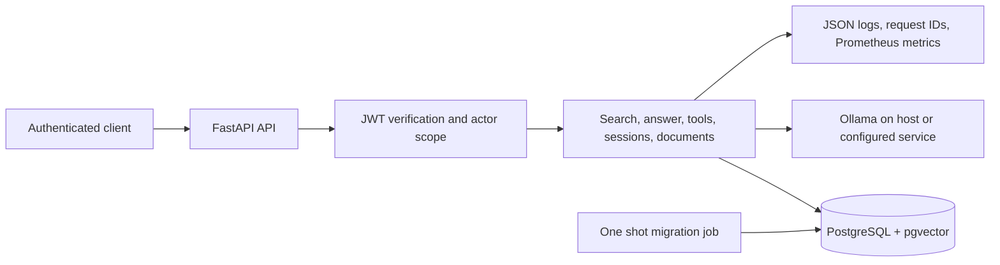

# Architecture overview

The API validates a signed access token before functional requests and derives
tenant, group, subject, and role values from verified claims. PostgreSQL
retrieval applies the actor's visibility before source text is returned to a
tool, reranker, prompt, or citation. The LLM proposes bounded searches and
findings; application code validates tools, scope, budgets, and citations.
See the focused policies for [retrieval](retrieval-policy.md), [tools](tool-policy.md),
[memory](memory-policy.md), [evidence review](verification-policy.md), and
[access controls](security-policy.md).

The local container topology runs PostgreSQL/pgvector, a one-shot migration
container, and the API. Ollama remains an explicitly configured dependency on
the host by default. Compose publishes the database and API only on loopback;
the metrics endpoint requires bearer authentication. The current request rate
and concurrency limits and Prometheus metrics are process-local.

For local setup, migration, health checks, backup/restore, and incident steps,
see the [operations guide](operations.md).
